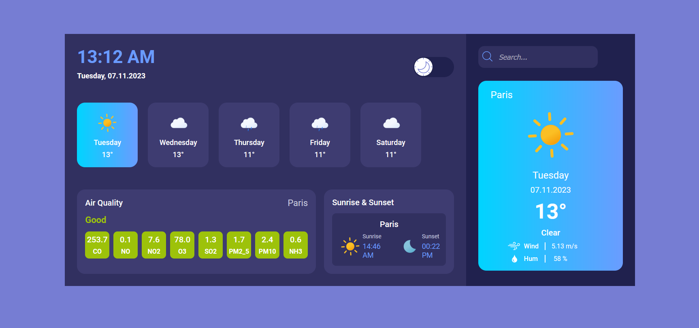

# Weather-App

> My weather application is a user-friendly interface that allows users to view current weather conditions in various cities around the world. The app utilizes the OpenWeatherMap API to provide up-to-date information on temperature, humidity, wind speed, and atmospheric pressure.
> Live demo [_here_](https://weather-app-theta-ruddy.vercel.app/).

## Table of Contents

- [General Info](#general-information)
- [Technologies Used](#technologies-used)
- [Features](#features)
- [Project Status](#project-status)
- [Room for Improvement](#room-for-improvement)

## Technologies Used

- React - version 18.2.0
- Typescript - version 5.0.2
- React-Query - version 4.29.5
- Zustand - version 4.3.7
- React-Router-Dom - version 6.14.1
- Sass - version 1.62.1

## Features

- Display weather forecast for 5 days with 3-hour step
- Automatic geolocation detection and weather forecast display
- Display air quality and sunrise/sunset data
- Option to switch between light and dark modes
